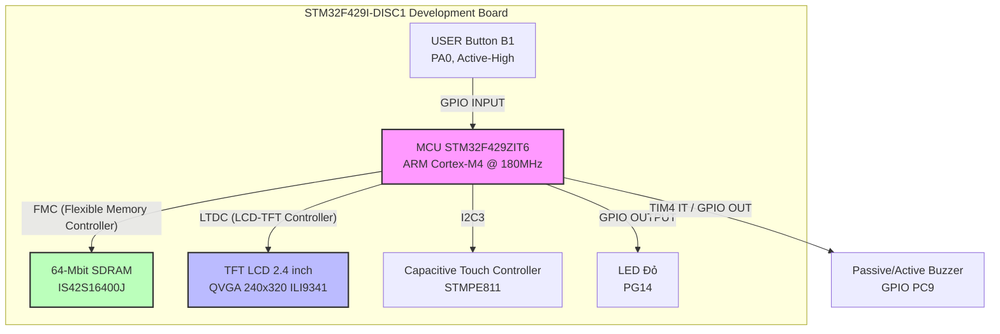
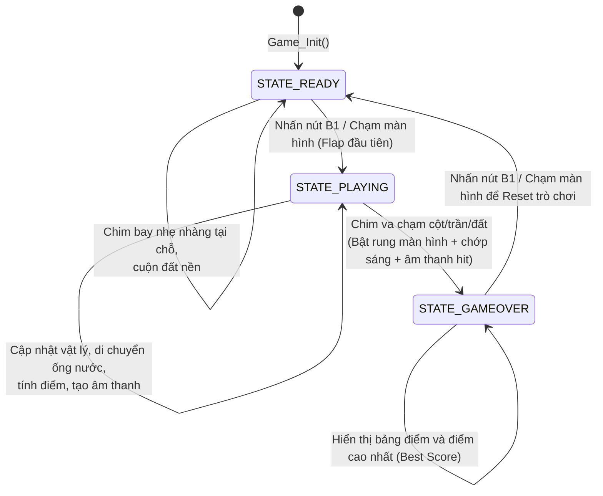

# BÁO CÁO ĐỒ ÁN MÔN HỌC: HỆ THỐNG NHÚNG
## ĐỀ TÀI: GAME FLAPPY BIRD TRÊN KIT STM32F429I-DISC1

---

## 1. GIỚI THIỆU ĐỀ TÀI
Flappy Bird là một trò chơi điện tử dạng cuộn cảnh màn hình ngang (side-scroller) nổi tiếng. Trong trò chơi này, người chơi điều khiển một chú chim cố gắng bay qua các hàng cột nước (ống nước) mà không chạm vào chúng. 

Đồ án này nghiên cứu và hiện thực hóa game Flappy Bird trên nền tảng **Hệ thống nhúng vi điều khiển STM32F429** sử dụng bộ phát triển **STM32F429I-DISC1**. Dự án khai thác sâu các tính năng phần cứng nâng cao của chip dòng hiệu năng cao STM32F4, bao gồm bộ điều khiển màn hình **LTDC**, bộ tăng tốc đồ họa phần cứng **DMA2D (Chrom-Art)**, bộ nhớ ngoài **SDRAM** làm Framebuffer, ngoại vi **Timer** tạo âm thanh, cảm ứng màn hình **I2C**, và lập trình xử lý sự kiện thời gian thực.

---

## 2. PHÂN CÔNG CÔNG VIỆC (WORK ASSIGNMENT)
Dưới đây là bảng phân công công việc chi tiết cho một nhóm sinh viên (giả định 3 thành viên, có thể thay đổi tùy theo thực tế):

| STT | Thành viên | Nhiệm vụ chi tiết | Kết quả đạt được |
| :--- | :--- | :--- | :--- |
| 1 | **Thành viên 1** *(Trưởng nhóm)* | - Cấu hình hệ thống (Clock SYSCLK = 180MHz) bằng STM32CubeMX.<br>- Tích hợp thư viện Board Support Package (BSP) cho LCD, SDRAM, Touch Screen.<br>- Thiết kế và đấu nối phần cứng ngoại vi (Buzzer phát âm thanh). | - Project chạy ổn định ở tần số cao.<br>- Màn hình LCD và SDRAM được khởi tạo thành công.<br>- Buzzer kêu đúng tần số. |
| 2 | **Thành viên 2** | - Phát triển thuật toán logic game (vật lý trọng lực, chuyển động của chim, ống nước).<br>- Lập trình máy trạng thái (STATE_READY, STATE_PLAYING, STATE_GAMEOVER).<br>- Xây dựng giải thuật độ khó động (Dynamic Difficulty) và xử lý va chạm. | - Logic game mượt mà, chính xác.<br>- Chim rơi tự do và nảy lên đúng thông số.<br>- Hệ thống tính điểm và phát hiện va chạm hoạt động chuẩn xác. |
| 3 | **Thành viên 3** | - Thiết kế đồ họa: Trích xuất, tối ưu và chuyển đổi các Sprite ảnh sang mảng hex màu ARGB8888.<br>- Hiện thực kỹ thuật Double Buffering chống giật hình và DMA2D tăng tốc vẽ.<br>- Lập trình hiệu ứng âm thanh (sound effects) qua ngắt Timer 4 và chớp tắt LED. | - Hình ảnh hiển thị sắc nét, không bị nháy hình (FPS duy trì ~50).<br>- Âm thanh các trạng thái (đập cánh, qua ống, chết) sinh động.<br>- Giao diện đồ họa chuyên nghiệp. |

---

## 3. THIẾT KẾ PHẦN CỨNG (HARDWARE DESIGN)

### 3.1. Sơ đồ khối hệ thống
Hệ thống sử dụng kit phát triển **STM32F429I-DISC1** tích hợp sẵn màn hình TFT LCD, bộ nhớ SDRAM và chip cảm ứng. Buzzer ngoài được kết nối qua chân GPIO mở rộng.



### 3.2. Chi tiết các thành phần phần cứng
1. **Vi điều khiển chính - STM32F429ZIT6**:
   - Nhân ARM Cortex-M4 có bộ xử lý dấu đóng băng (FPU), chạy ở tần số tối đa **180 MHz** (đạt 225 DMIPS).
   - Bộ nhớ trong: **2 MB Flash**, **256 KB SRAM**.
   - Tích hợp bộ điều khiển đồ họa **LTDC** và bộ tăng tốc đồ họa **DMA2D** (Chrom-Art Accelerator™).
2. **Màn hình hiển thị LCD TFT**:
   - Kích thước 2.4 inch, độ phân giải **240x320 pixels** (QVGA), hiển thị tối đa 262,000 màu.
   - Chip điều khiển màn hình tích hợp: **ILI9341**.
   - Giao tiếp dữ liệu bằng bus RGB kết nối trực tiếp với bộ điều khiển LTDC của MCU, cấu hình SPI để truyền lệnh điều khiển.
3. **Bộ nhớ ngoài SDRAM (64-Mbit / 8MB)**:
   - Chip nhớ **IS42S16400J** kết nối qua bộ điều khiển bộ nhớ tĩnh **FMC** (Flexible Memory Controller) của STM32.
   - Đóng vai trò cực kỳ quan trọng trong việc lưu trữ Framebuffer. Do dung lượng SRAM của chip không đủ lớn để chứa đồng thời 2 buffer màn hình màu 32-bit (mỗi buffer tốn $240 \times 320 \times 4 \text{ bytes} \approx 300 \text{ KB}$), SDRAM được sử dụng để cung cấp không gian lưu trữ tại địa chỉ gốc `0xD0000000`.
4. **Chip điều khiển cảm ứng (Touch Screen Controller)**:
   - Chip **STMPE811** (hoặc tương đương) kết nối với MCU thông qua bus **I2C3**. Cho phép phát hiện các thao tác chạm vào màn hình của người chơi làm tín hiệu nhảy cho chim.
5. **Nút nhấn USER (B1)**:
   - Nút nhấn tích hợp sẵn trên board nối vào chân **PA0** (cấu hình Input Pull-down, nhấn nút trả về mức Logic 1 - Active-High).
6. **Buzzer ngoài phát âm thanh**:
   - Một chiếc loa/còi chíp (Buzzer) được đấu nối bên ngoài vào chân **PC9** của MCU.
   - Để đồng bộ hiệu ứng nghe nhìn, đèn LED đỏ **PG14** tích hợp trên board sẽ chớp tắt theo cùng tần số với âm thanh phát ra.

---

## 4. THIẾT KẾ PHẦN MỀM (SOFTWARE DESIGN)

### 4.1. Kiến trúc luồng chương trình (Game Loop)
Chương trình được thiết kế chạy đơn luồng (Single-thread), điều tiết tốc độ bằng bộ đếm thời gian hệ thống `HAL_GetTick()`. 

- **Tần số khung hình**: Hệ thống chạy ổn định ở mức **~50 FPS** (tương đương chu kỳ **$20\text{ ms}$** mỗi khung hình).
- **Trình tự xử lý trong vòng lặp vô hạn `Game_Loop()`**:
  1. Đọc dữ liệu đầu vào (Nút nhấn PA0 + Màn hình cảm ứng qua I2C).
  2. Cập nhật máy trạng thái trò chơi (Ready, Playing, Game Over).
  3. Cập nhật vật lý chuyển động (Chim rơi, ống nước di chuyển, tính điểm và va chạm).
  4. Cập nhật hiệu ứng âm thanh thời gian thực (đọc từng nốt nhạc/tần số theo khung hình).
  5. Thực hiện vẽ đồ họa vào Framebuffer ẩn (Back Buffer).
  6. Hoán đổi buffer khi xảy ra VSYNC (Vertical Blanking) để cập nhật màn hình không nhấp nháy.
  7. Trì hoãn cho đến khi đủ $20\text{ ms}$.



### 4.2. Kỹ thuật đồ họa nâng cao
Để loại bỏ hoàn toàn hiện tượng nháy hình (flickering) và xé hình (tearing) đặc trưng trên màn hình LCD rẻ tiền, phần mềm áp dụng hai kỹ thuật cốt lõi:

#### A. Double Buffering đồng bộ VSYNC
Chương trình thiết lập 2 vùng nhớ đệm màn hình (mỗi vùng chứa $240 \times 320$ pixels, định dạng ARGB8888 màu 32-bit thực, tốn 4 byte/pixel) trong bộ nhớ SDRAM bên ngoài:
- **Layer 0 (Địa chỉ `0xD0000000`)**
- **Layer 1 (Địa chỉ `0xD004B000`)**

Tại mỗi thời điểm, một Layer sẽ được chọn làm **Front Buffer** (đang hiển thị lên màn hình), Layer còn lại đóng vai trò **Back Buffer** (dùng để vẽ đè nội dung mới lên). 

```c
static void draw_end(void)
{
    uint32_t back_fb = (g_active_layer == 0) ? LCD_FB_LAYER0 : LCD_FB_LAYER1;

    // Gán địa chỉ hiển thị mới cho LTDC
    BSP_LCD_SetLayerAddress(0, back_fb);
    // Yêu cầu nạp lại địa chỉ mới ngay tại chu kỳ Vertical Blanking (VSYNC) tiếp theo
    BSP_LCD_Relaod(LCD_RELOAD_VERTICAL_BLANKING);
    // Hoán đổi vai trò của hai layer
    g_active_layer = 1u - g_active_layer;
}
```

#### B. Tăng tốc đồ họa bằng phần cứng DMA2D (Chrom-Art)
CPU của STM32 không cần tốn thời gian chạy vòng lặp sao chép từng pixel để vẽ hình ảnh. Thay vào đó, bộ tăng tốc **DMA2D** được cấu hình thực hiện vẽ trực tiếp:
- **Chế độ sao chép trực tiếp (`DMA2D_M2M`)**: Dùng cho hình nền (background) và mặt đất (ground) vốn là các ảnh opaque không trong suốt. DMA2D sẽ chuyển nhanh dữ liệu khối từ Flash sang SDRAM cực nhanh.
- **Chế độ hòa trộn Alpha (`DMA2D_M2M_BLEND`)**: Dùng cho chú chim (bird) và các ống nước (pipes) có chứa các pixel trong suốt (Kênh Alpha). DMA2D tự động hòa trộn màu của Sprite nguồn với Framebuffer đích bằng phần cứng.

```c
// Trích xuất cấu hình DMA2D hòa trộn Alpha từ game.c
DMA2D_HandleTypeDef hdma2d = {0};
hdma2d.Instance = DMA2D;
hdma2d.Init.Mode = DMA2D_M2M_BLEND;
hdma2d.Init.ColorMode = DMA2D_OUTPUT_ARGB8888;
// Background Layer 0
hdma2d.LayerCfg[0].AlphaMode = DMA2D_NO_MODIF_ALPHA;
hdma2d.LayerCfg[0].InputColorMode = DMA2D_INPUT_ARGB8888;
// Foreground Layer 1
hdma2d.LayerCfg[1].AlphaMode = DMA2D_NO_MODIF_ALPHA;
hdma2d.LayerCfg[1].InputColorMode = DMA2D_INPUT_ARGB8888;

HAL_DMA2D_Init(&hdma2d);
```

### 4.3. Xử lý Vật lý, Va chạm và Điều chỉnh Độ khó Động (Dynamic Difficulty)
1. **Phương trình chuyển động của chim**:
   Mỗi khung hình ($20\text{ ms}$), vị trí dọc $Y$ của chim và vận tốc $V_y$ được cập nhật theo gia tốc trọng lực:
   $$V_y[t+1] = \min(V_y[t] + \text{GRAVITY}, \text{MAX\_FALL})$$
   $$Y[t+1] = Y[t] + V_y[t+1]$$
   Khi người chơi kích hoạt tín hiệu nhảy (flap): $V_y = \text{FLAP\_VELOCITY}$ (mang giá trị âm để chim bay vọt lên).

2. **Thuật toán phát hiện va chạm**:
   Hệ thống kiểm tra va chạm dựa trên khoảng cách hình học đơn giản để đảm bảo tốc độ tính toán nhanh nhất:
   - Nếu tọa độ của chim vượt qua giới hạn biên trên hoặc chạm vào đất ($Y - R < 0$ hoặc $Y + R > \text{GROUND\_Y}$) -> Xảy ra va chạm.
   - Khi chim nằm trong phạm vi trục X của một ống nước ($X_{\text{chim}} + R_{\text{chim}} > X_{\text{ống}}$ và $X_{\text{chim}} - R_{\text{chim}} < X_{\text{ống}} + W_{\text{ống}}$): kiểm tra xem chim có chui lọt khe hở an toàn hay không. Nếu $Y_{\text{chim}} - R_{\text{chim}} < \text{Khe\_trên}$ hoặc $Y_{\text{chim}} + R_{\text{chim}} > \text{Khe\_dưới}$ -> Xảy ra va chạm.

3. **Điều chỉnh độ khó động**:
   Nhằm tăng tính hấp dẫn, hệ thống tự động tăng độ khó dựa trên số điểm hiện tại của người chơi:
   - **Tốc độ ống nước (`PIPE_SPEED`)**: Bắt đầu ở mức 3 pixels/khung hình, tăng lên 4 khi đạt 10 điểm, và đạt mức tối đa 5 khi $\ge 25$ điểm.
   - **Độ rộng khe hở giữa 2 ống (`GAP_H`)**: Co hẹp lại từ 96 pixels ban đầu xuống còn 86 pixels (khi đạt 10 điểm), và chỉ còn 76 pixels khi người chơi đạt từ 20 điểm trở lên.

### 4.4. Module tạo Âm thanh và Hiệu ứng Rung phản hồi (Haptic)
1. **Module Âm thanh**:
   - Sử dụng **Timer 4** o che do Base ngắt định thời.
   - Hệ thống đếm tần số nhịp để điều khiển bật/tắt chân GPIO **PC9** nối với Buzzer, tạo ra sóng vuông có tần số thay đổi tùy thuộc vào hiệu ứng âm thanh mong muốn:
     - `SOUND_WING` (đập cánh): Tần số tăng nhanh từ 450Hz đến 900Hz trong 4 khung hình.
     - `SOUND_POINT` (ăn điểm): Gồm hai âm cao $880\text{ Hz}$ rồi lên $1320\text{ Hz}$.
     - `SOUND_HIT_DIE` (va chạm chết): Tần số giảm nhanh từ 700Hz xuống 140Hz trong 15 khung hình.
   - Đồng thời, LED đỏ **PG14** được bật tắt liên tục trong ngắt Timer để nhấp nháy cùng tần số với loa, tăng trải nghiệm phản hồi.

2. **Hiệu ứng va chạm (Rung màn hình & Chớp sáng)**:
   - Khi xảy ra va chạm chết chim, biến điều khiển `g_shake_frames` được đặt bằng 12. Trong 12 khung hình tiếp theo, tọa độ vẽ toàn bộ màn hình (Sprite nền, ống nước, chim) sẽ cộng thêm một lượng dịch chuyển ngẫu nhiên từ $-4$ đến $+4$ pixels tạo hiệu ứng rung vật lý dữ dội.
   - Đồng thời, biến `g_flash_frames = 2` sẽ ghi đè toàn bộ Framebuffer thành màu trắng xóa (`0xFFFFFFFF`) trong 2 khung hình đầu để mô phỏng vụ nổ va chạm trước khi chuyển sang màn hình hiển thị kết quả Game Over.

### 4.5. Cơ chế lưu trữ kỷ lục điểm số (High Score) vào bộ nhớ Flash
Để bảo toàn điểm số cao nhất ngay cả khi tắt nguồn hệ thống, chương trình lưu trữ `g_best` trực tiếp vào một Sector trống trong bộ nhớ Flash của MCU:
- **Địa chỉ Flash**: `0x081E0000` (nằm ở Sector 23 - sector cuối cùng của vi điều khiển STM32F429ZIT6).
- **Hàm `load_best_score()`**: Khi khởi động hệ thống (`Game_Init`), vi điều khiển duyệt qua sector 128KB (32768 từ 32-bit) từ địa chỉ gốc `0x081E0000` để tìm vị trí ô trống đầu tiên (chứa giá trị `0xFFFFFFFF`). Điểm số kỷ lục ghi gần đây nhất (ở ô nhớ ngay trước ô trống) sẽ được tải vào biến `g_best`. Nếu sector trống hoàn toàn, điểm số kỷ lục được đặt bằng 0.
- **Hàm `save_best_score(uint32_t score)`**: Khi người chơi va chạm và đạt kỷ lục mới:
  1. Sử dụng thư viện HAL mở khóa Flash: `HAL_FLASH_Unlock()`.
  2. Tìm vị trí ô trống đầu tiên trong sector.
  3. Nếu sector đã đầy (duyệt hết 128KB mà không còn ô trống), tiến hành xóa Sector 23 bằng hàm `HAL_FLASHEx_Erase` rồi ghi điểm số mới vào địa chỉ gốc.
  4. Nếu sector còn ô trống, ghi tuần tự điểm số mới vào ô trống tiếp theo bằng `HAL_FLASH_Program` (quá trình chỉ mất khoảng **16 microseconds**, hoàn toàn loại bỏ hiện tượng đứng hình/khựng game 1-2 giây thường thấy khi xóa sector).
  5. Khóa lại Flash bảo mật: `HAL_FLASH_Lock()`.

---

## 5. HƯỚNG DẪN CÀI ĐẶT VÀ BIÊN DỊCH
Để cài đặt và chạy thử dự án trên kit STM32F429I-DISC1, thực hiện theo các bước sau:

1. **Chuẩn bị phần cứng**:
   - Cắm kit STM32F429I-DISC1 vào máy tính qua cổng USB ST-Link tích hợp trên board.
   - Đấu nối một chiếc loa Buzzer mini: Chân dương nối vào **PC9** (mở rộng trên hàng header của kit), chân âm nối vào chân **GND** của kit.
2. **Biên dịch mã nguồn**:
   - Mở IDE **STM32CubeIDE**.
   - Import project vào workspace. Nhấn chuột phải chọn **Refresh (F5)** để cập nhật đầy đủ các file mã nguồn.
   - Nhấn **Ctrl + B** để Build Project. Quá trình build lần đầu sẽ dịch toàn bộ thư viện HAL và BSP.
3. **Nạp code và Debug**:
   - Chọn menu **Run -> Debug As -> STM32 Cortex-M C/C++ Application**.
   - IDE sẽ tự động nạp file `.elf` vào bộ nhớ Flash của chip thông qua ST-Link.
4. **Trải nghiệm Game**:
   - Khi khởi động, màn hình LCD sẽ hiện chữ "FLAPPY BIRD" và hướng dẫn.
   - Nhấn nút xanh **USER (B1)** hoặc chạm vào màn hình cảm ứng để bắt đầu chơi.
   - Nhấn nhấp để giữ chim thăng bằng qua các ống nước.

---

## 6. KẾT LUẬN VÀ HƯỚNG PHÁT TRIỂN
### 6.1. Kết quả đạt được
- Ứng dụng thành công các tính năng phần cứng đồ họa chuyên dụng của STM32F429 là LTDC và DMA2D để tạo ra game có đồ họa màu 32-bit mượt mà ở tốc độ 50 FPS không giật lag.
- Hiện thực thành công kỹ thuật Double Buffering sử dụng bộ nhớ ngoài SDRAM.
- Tích hợp đầy đủ phản hồi âm thanh qua còi buzzer ngoài và phản hồi hình ảnh qua cơ chế rung màn hình & flash.
- Hiện thực thành công cơ chế đọc/ghi bộ nhớ Flash (Sector 23) để lưu trữ điểm số kỷ lục (High Score) của người chơi một cách bền vững không bị mất khi mất nguồn.

### 6.2. Hướng phát triển tiếp theo
- Hỗ trợ hiển thị thêm các chướng ngại vật di động (ví dụ: ống nước dịch chuyển lên xuống).
- Cải tiến đồ họa: Vẽ thêm bóng đổ, hỗ trợ hoạt ảnh chim đập cánh mượt hơn nữa.
